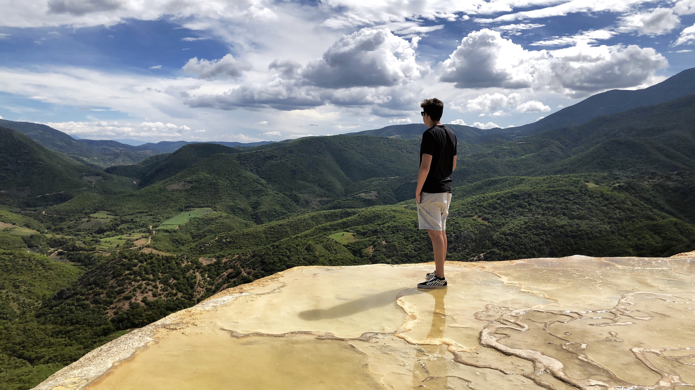

<h2>Welcome to my Github! I'm Brian</h2>

### About Me

I am a student at UC San Diego majoring in **Electrical and Computer Engineering** and have recently launched my tutoring company called [Better Times Tutoring](https://bettertimestutoring.com).\
To briefly sum up my goals, I would say I've transfered a big portion of my time on self improvement and while this may sound generic it can be understood by one of my favorite quotes stated as 
> Be willing to be uncomfortable. Be comfortable being uncomfortable. It may get tough, but it's a small price to pay for living a dream.

### Personal Hobbies and Interests: 

- Playing the guitar
- Salt and Fresh water fishing
- Strength Training 
- Cooking specifically dinner oriented dishes 
- Reading specifically about entrepreneurship, finance, technology, and self improvement 


### Coding Languages and Skills: 
1. &nbsp;
2. &nbsp;
3. &nbsp;
4. &nbsp;
5. &nbsp;
6. 
7. &nbsp;
8. &nbsp;
9. &nbsp;
10. &nbsp;
11. 
12. &nbsp;

### Task List
- [x] Launch a tutoring company
- [ ] Find start-up/internship opportunities
- [ ] 405 Deadlift 
- [x] 225 Bench
- [ ] 315 Squat 
- [ ] Complete app development project

```
Contact Info: b1mendez@ucsd.edu
```
